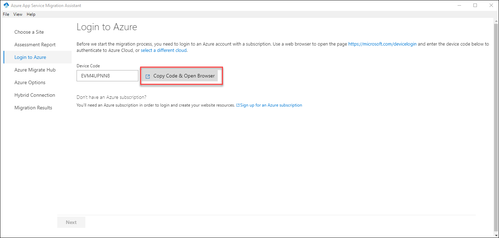
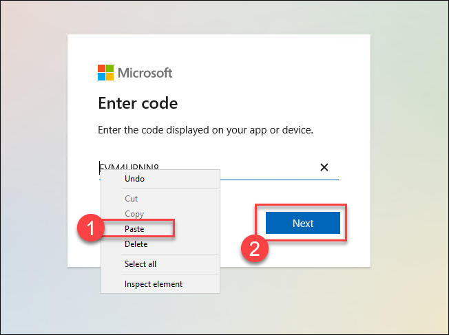
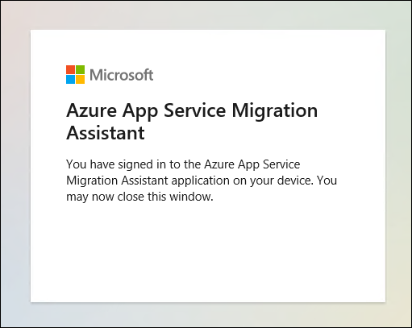
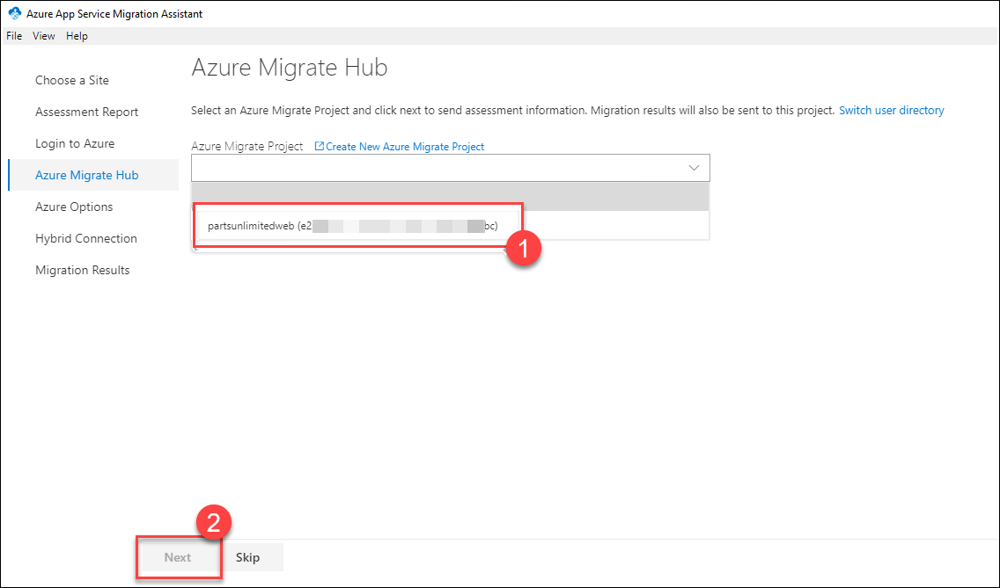
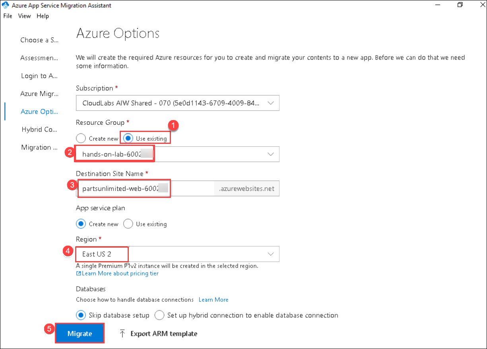
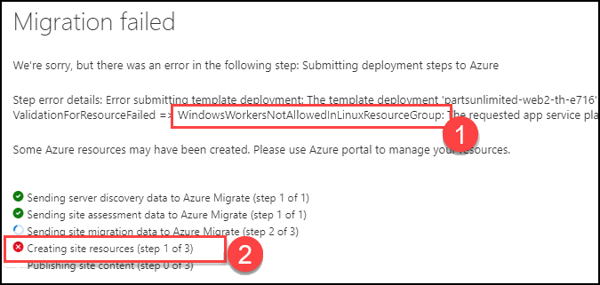
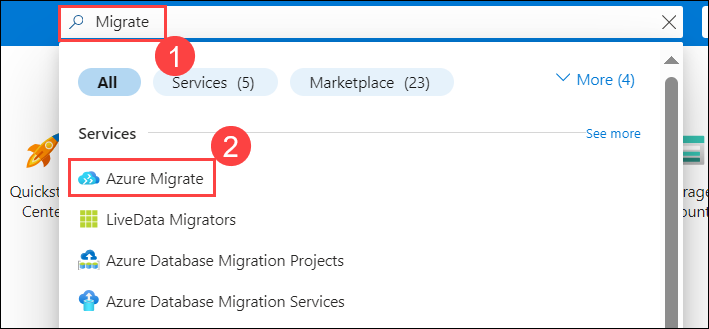
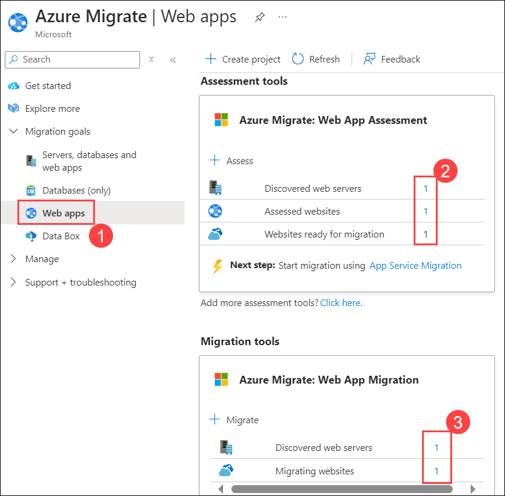
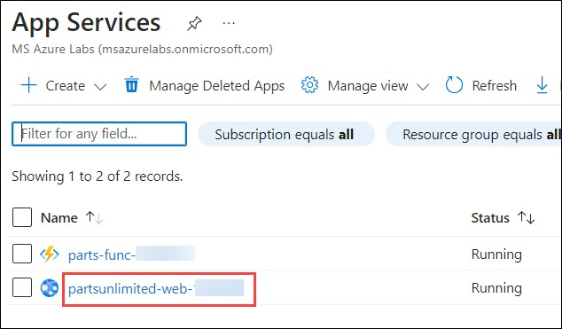
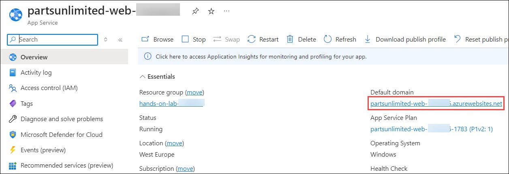

# Exercise 3: Migrate your application with App Service Migration Assistant
 
### Estimated Duration: 20 minutes

## Overview

App Service Migration Assistant is a tool designed to assess and migrate web applications to Azure App Service. You will explore how the tool identifies compatibility issues, provides remediation recommendations, and facilitates the migration of the web application to Azure’s platform-as-a-service (PaaS) environment.

## Lab objectives

You will be able to complete the following tasks:

- Task 1: Migrate the web application to Azure App Service

## Task 1: Migrate the web application to Azure App Service

In this task, after reviewing the assessment results, you have ensured the web application is a good candidate for migration to Azure App Service. Now, we will continue migrating the application.

1. In order to continue with the migration of our website, Azure App Service Migration Assistant needs access to our Azure Subscription. Select **Copy Code & Open Browser** button to be redirected to the Azure Portal.

   

2. A new tab opens to the login page within the Edge browser. Right-click the text box and select **Paste (1)** to paste your login code. Select **Next (2)** to give subscription access to App Service Migration Assistant.

    

3. Continue the login process with your Azure Subscription credentials. When you see the message that says **You have signed in to the Azure App Service Migration Assistant application on your device**, close the browser tab and minimize the Edge browser window to return to the App Service Migration Assistant Window.

    

4. Select the Azure Migrate project we created **(1)** in the previous exercise to submit the results of our migration. Select **Next (2)** to continue.

    

5. In order to migrate the Parts Unlimited website, we have to create an App Service Plan. The Azure App Service Migration Assistant will take care of all the requirements needed. Select **Use existing (1)** and select the resource group **hands-on-lab-<inject key="DeploymentID" enableCopy="false"/>** **(2)** as your deployment target. App Service requires a globally unique Site Name, enter **partsunlimited-web-<inject key="DeploymentID" enableCopy="false"/>** **(3)** for **Destination Site Name**. Select the **<inject key="location" style="color:red" />** **(4)** region. Click **Migrate** **(5)** to start the migration process.

    

    > **WARNING:** If your migration fails with a **WindowsWorkersNotAllowedInLinuxResourceGroup (1)** It may be due to the incorrect region. Try the migration process again, but this time select the correct region.  
    >
    > 

6. We have just completed the migration of the Parts Unlimited website from IIS into a Virtual Machine to Azure App Service. Congratulations. Let's go back to the Azure Portal and look into Azure Migrate. Search for `migrate` **(1)** on the Azure Portal and select **Azure Migrate (2)**.

    

7. Switch to the **Web apps (1)** section. See the number of discovered web servers, assessed websites **(2)** and migrated websites change **(3)**. Keep in mind that you might need to wait for 5 to 10 minutes for the results to show up. You can use the **Refresh** button on the page to see the latest status.

    

8. Now navigate back to App Service resource and select **partsunlimited-web-<inject key="DeploymentID" enableCopy="false"/>**
  
   

9. In the App Service page, click on **Default domain**.

   

10. You will be navigated to a web page which we have migrated to App Service

    
   
> **Congratulations** on completing the task! Now, it's time to validate it. Here are the steps:
  - Hit the Validate button for the corresponding task. If you receive a success message, you can proceed to the next task. 
  - If not, carefully read the error message and retry the step, following the instructions in the lab guide.
  - If you need any assistance, please contact us at cloudlabs-support@spektrasystems.com. We are available 24/7 to help you out.

<validation step="83075887-7dea-4a4f-882d-e3256324d2ea" />

## Summary

In this exercise you have covered the following:
 
 - Migrated the on-prem web application to Azure using App Service Migration Assistant. 

### You have successfully completed the lab
