# Exercise 3: Migrate the On-prem Database to Azure and configure it with your App service

Duration: 80 minutes

The next step of Part Unlimited's migration project is the assessment and migration of its database. Currently, the database lives on SQL Server 2008 R2 on a virtual machine. You will use an **Azure Migrate: Database Assessment** tool called **Microsoft Data Migration Assistant (DMA)** to assess the `PartsUnlimited` database for migration to Azure SQL Database. The assessment generates a report detailing any feature parity and compatibility issues between the on-premises database and Azure SQL Database. After the assessment, you will use an **Azure Migrate: Database Migration** service called **Azure Database Migration Service (DMS)**. During the exercise, you will use a simulated on-premises environment hosted on virtual machines running on Azure.
## Lab objectives

You will be able to complete the following tasks:

- Task 1: Connect to your SqlServer2008 VM with RDP

- Task 2: Perform assessment for migration to Azure SQL Database

- Task 3: Retrieve connection information for SQL Databases (Optional)

- Task 4: Migrate the database schema using the Data Migration Assistant

- Task 5: Migrate the database using the Azure Database Migration Service 

## Task 1: Connect to your SqlServer2008 VM with RDP

1. From your lab environment (**WebVM**), in the search bar, **Search (1)** for **RDP (2)** and **select** the **Remote Desktop Connection (3)** app.
   
   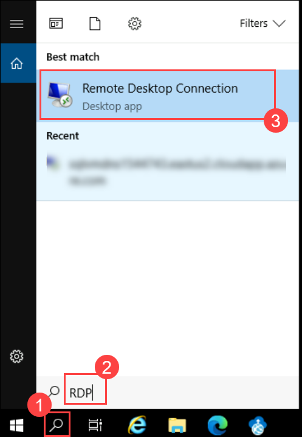

2. Paste the **SQLVM DNS Name (1)** in the **Computer** field and click on **Connect (2)**.
   * **SQLVM DNS Name**: **<inject key="SQLVM DNS Name" style="color:blue" />**

   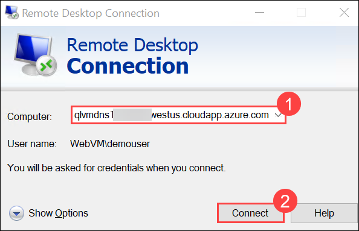  
 
3. Now, enter the SQLVM **Username (1)**, and **password (2)** provided below and then click on the **OK* (3)* button. Please add the **dot** and **back-slash** `.\` before the username.
   * **username**: **<inject key="SQLVM Username" style="color:blue" />** 
   * **password**: **<inject key="SQLVM Password" style="color:blue" />**
   
   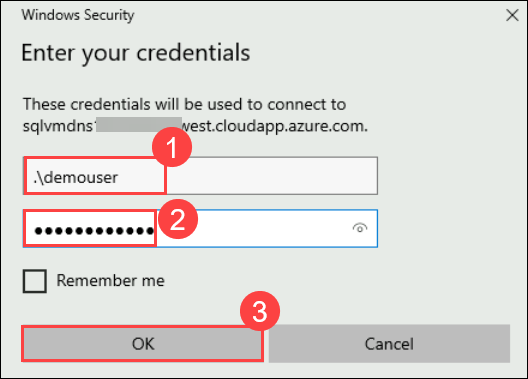 

4. Next, click on the **Yes** button to accept the certificate and add in trusted certificates.

   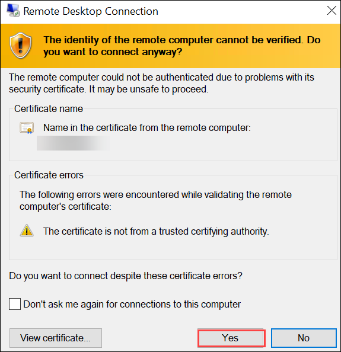

## Task 2: Perform assessment for migration to Azure SQL Database

Parts Unlimited would like an assessment to see what potential issues they might need to address in moving their database to Azure SQL Database. In this task, you will use the [Microsoft Data Migration Assistant](https://docs.microsoft.com/sql/dma/dma-overview?view=sql-server-2017) (DMA) to assess the `PartsUnlimited` database against Azure SQL Database (Azure SQL DB). Data Migration Assistant (DMA) enables you to upgrade to a modern data platform by detecting compatibility issues that can impact database functionality on your new version of SQL Server or Azure SQL Database. It recommends performance and reliability improvements for your target environment. The assessment generates a report detailing any feature parity and compatibility issues between the on-premises database and the Azure SQL DB service.

> **Note**: The Database Migration Assistant is already installed on your Lab (Web) VM. If not found, it can be downloaded through Azure Migrate or from the [Microsoft Download Center](https://go.microsoft.com/fwlink/?linkid=2090807) as well, and as Data Migration Assistant is dependent on .NET Framework 4.8 download and install .Net Framework from [here](https://go.microsoft.com/fwlink/?LinkId=2085155) and **restart** the VM before you install Data Migration Assistant.

1. Launch DMA from the Windows. click on  **Start** menu.

   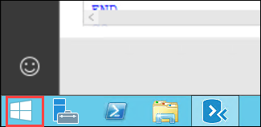
  
1. Start typing **"data migration" (1)** into the search bar, and then selecting **Microsoft Data Migration Assistant (2)** from the search results.

    > **Note**: There is a known issue with screen resolution when using an RDP connection to Windows Server 2008 R2, which may affect some users. This issue presents itself as very small, hard to read text on the screen. The workaround for this is to use a second monitor for the RDP display, which should allow you to scale up the resolution to make the text larger.

   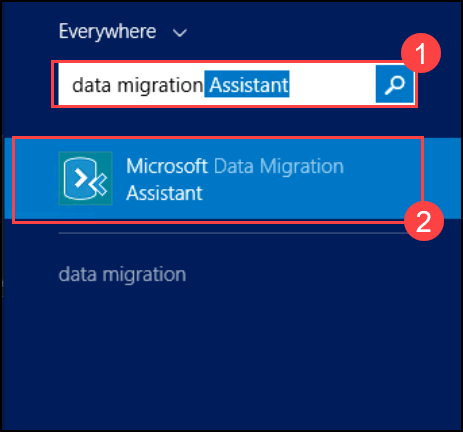

1. In the DMA dialog, select **+** from the left-hand menu to create a new project.

   

1. In the New Project pane, set the name of the project **(1)** and make sure the following values are selected:

   - **Project type**: Select **Assessment (1)**.
   - **Project name (1)**: Enter **Assessment (2)**
   - **Assessment type**: Select **Database Engine (3)**.
   - **Source server type**: Select **SQL Server (4)**.
   - **Target server type**: Select **Azure SQL Database (5)**.
   - Select **Create (6)**.

   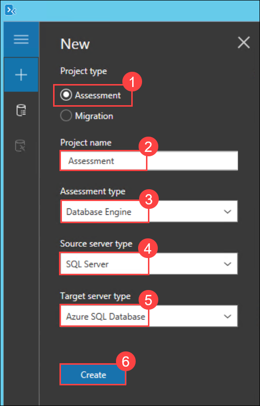

1. On the **Options** screen, ensure **Check database compatibility (1)** and **Check feature parity (1)** are both checked, and then select **Next (2)**.

   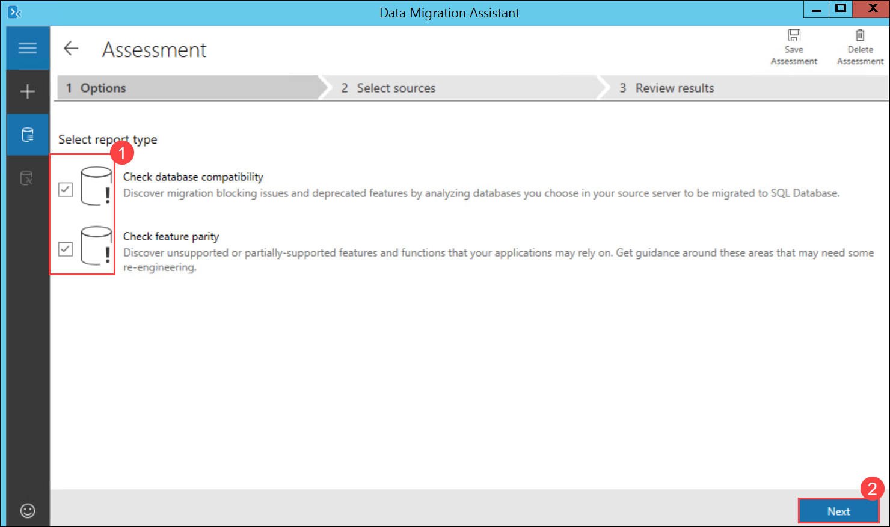

1. On the **Sources** screen, enter the following into the **Connect to a server** dialog that appears on the right-hand side:

    - **Server name**: Enter **SQLSERVER2008 (1)**
    - **Authentication type**: Select **SQL Server Authentication (2)**.
    - **Username**: Enter **PUWebSite (3)**
    - **Password**: Enter **<inject key="SQLVM Password" /> (4)**
    - **Encrypt connection**: Check this box if not checked **(5)**.
    - **Trust server certificate**: Check this box **(6)**.
    - Select **Connect (7)**.

    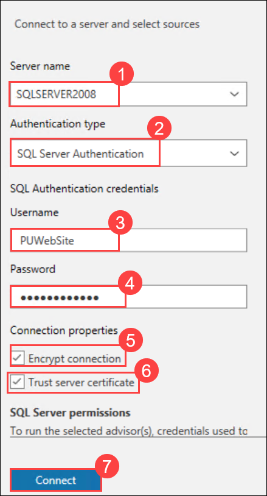

1. In the **Add sources** dialog that appears next, check the box for `PartsUnlimited` **(1)** and select **Add (2)**.

    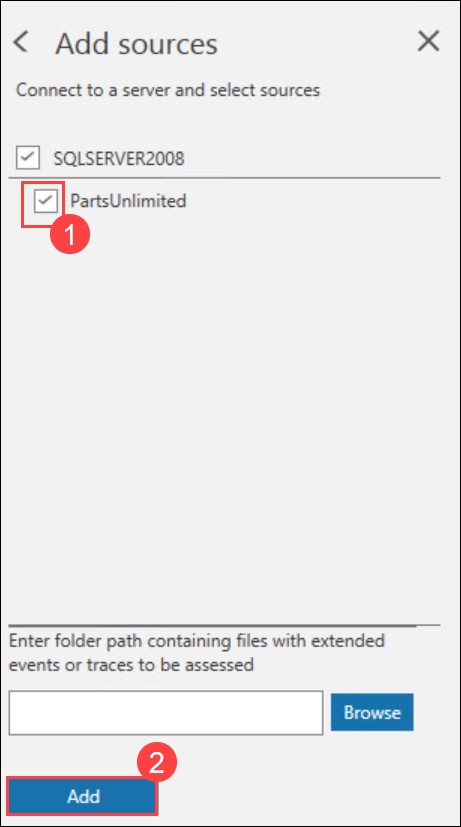

1. Select **Start Assessment**.

    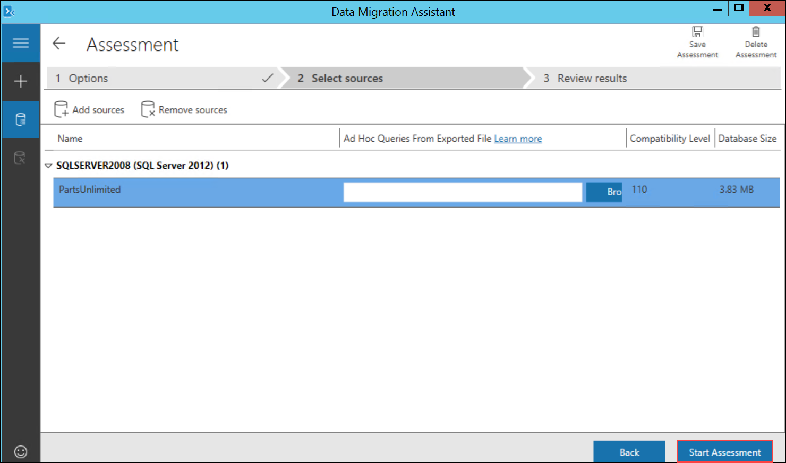

1. Take a moment to review the assessment for migrating to Azure SQL DB. The SQL Server feature parity report shows that Analysis Services and SQL Server Reporting Services are unsupported, but these do not affect any objects in the `PartsUnlimited` database, so we won't block a migration. If there is no SQL Server feature parity, then proceed to the next step.

    

1. Now, select **Compatibility issues (1)** to review that report as well.

    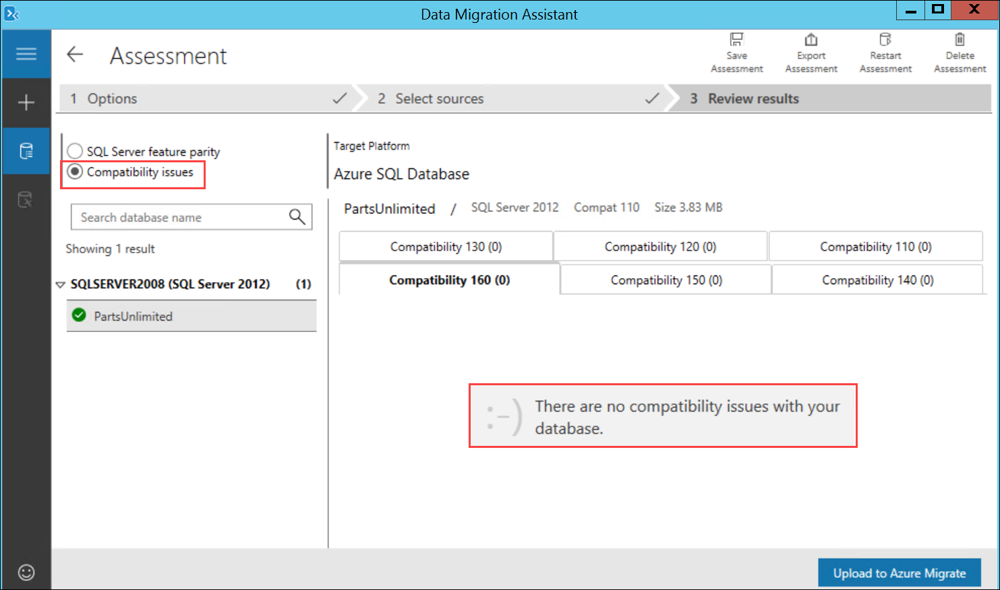

    The DMA assessment for migrating the `PartsUnlimited` database to a target platform of Azure SQL DB reveals that no issues or features are preventing Parts Unlimited from migrating their database to Azure SQL DB.

1. Select **Upload to Azure Migrate** to upload assessment results to Azure.

    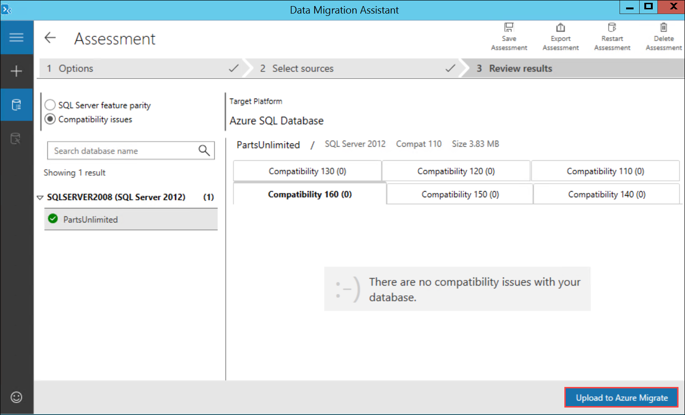

1. Select the right **Azure** environment **(1)** your subscription lives. Select **Connect (2)** to proceed to the Azure login screen.

    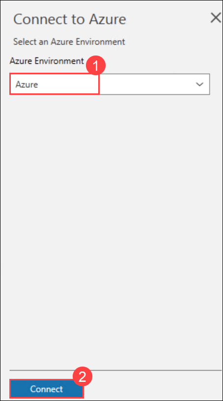

1. Please use the  below credentials to login.
    * Email/Username: <inject key="AzureAdUserEmail"></inject>
    * Password: <inject key="AzureAdUserPassword"></inject>

    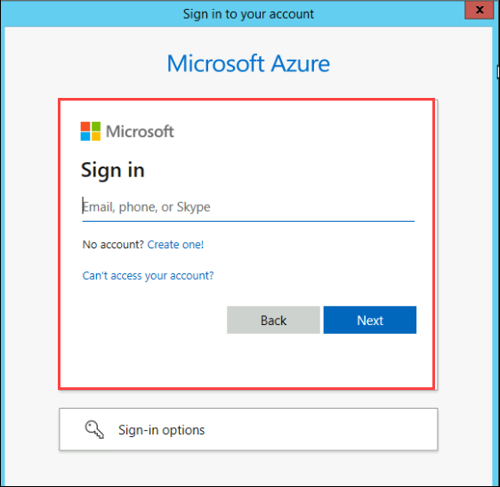

1. Click on **Yes**, if any pop up appears.

1. Select your subscription **(1)** and the **partsunlimitedweb<inject key="DeploymentID" enableCopy="false"/>** Azure Migrate project **(2)**. Select **Upload (3)** to start the upload to Azure.

    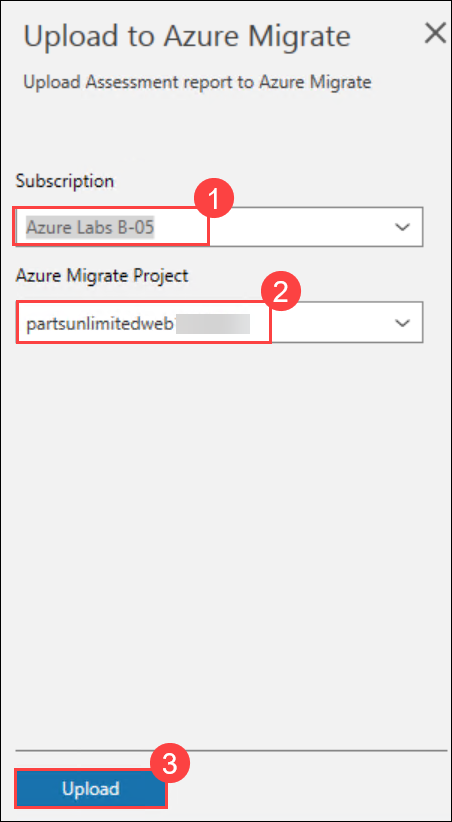

    > **Note**: If you encounter **Failed to fetch subscription list from Azure, Strong Authentication is required (1)** you might not see some of your subscription because of MFA limitations. You should still be able to see your lab subscription.

     

1. Once the upload is complete, select **OK**.

    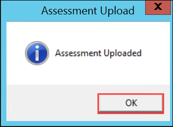

1. Navigate to the **Azure Migrate** page on the Azure Portal.
    
1. Select the **Databases (only) (1)** page on Azure Migrate. Observe the number of assessed database instances **(2)** and the number of databases ready for Azure SQL DB **(2)**. Keep in mind that you might need to wait for 5 to 10 minutes for the results to show up. You can use the **Refresh** button on the page to see the latest status.

    

## Task 3: Retrieve connection information for SQL Databases (Optional)

In this task, you will retrieve the Fully Qualified Domain Name for the Azure SQL Database. This information is needed to connect to the Azure SQL Database from Azure Data Migration Service and Azure Data Migration Assistant.

1. On the [Azure portal](https://portal.azure.com), from the **Search resources, services, and docs** blade, search for and select **SQL database (1)**, and then select **SQL database (2)** from the services.

   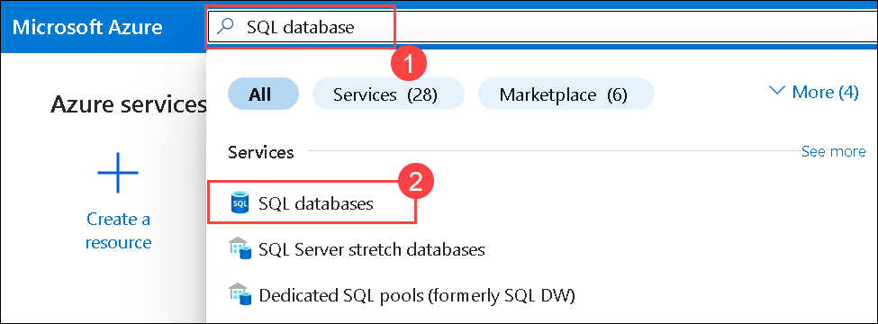

1. Navigate to your **SQL database** resource by selecting the **parts** SQL database resource from the resources list.

   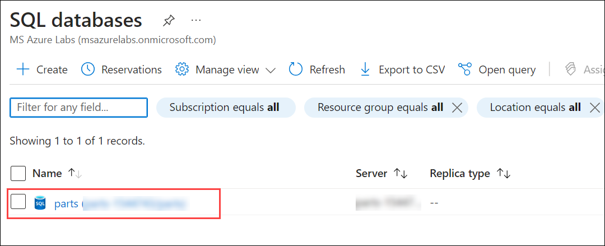

1. On the **Overview** Blade of your SQL database, copy the **Server name** and paste the value into a text editor, such as Notepad.exe, for later reference.

   

## Task 4: Migrate the database schema using the Data Migration Assistant

After you have reviewed the assessment results and you have ensured the database is a candidate for migration to Azure SQL Database, please use the Data Migration Assistant to migrate the schema to Azure SQL Database.

1. Return to the Data Migration Assistant, and select the New **(+)** icon in the left-hand menu.

1. In the New project dialog, enter the following:

   - **Project type (1)**: Select **Migration (1)**.
   - **Project name (2)**: Enter **Migration (2)**
   - **Source server type**: Select **SQL Server (3)**.
   - **Target server type**: Select **Azure SQL Database (4)**.
   - **Migration scope (3)**: Select **Schema only (5)**.
   - Select **Create (6)**.

   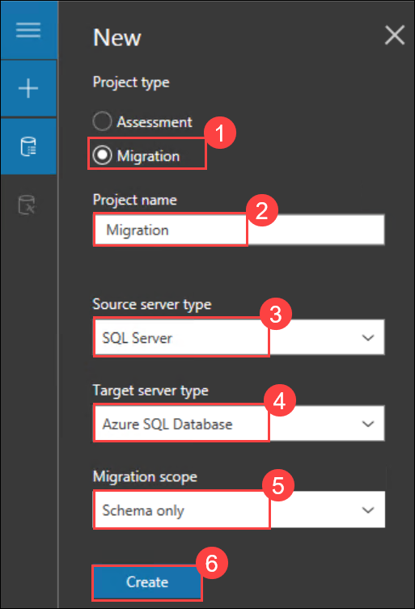

1. On the **Select source** tab, enter the following:

   - **Server name**: Enter **SQLSERVER2008 (1)**.
   - **Authentication type**: Select **SQL Server Authentication (2)**.
   - **Username**: Enter **PUWebSite (3)**
   - **Password**: Enter **<inject key="SQLVM Password" /> (4)**
   - **Encrypt connection**: Check this box **(5)**.
   - **Trust server certificate**: Check this box **(6)**.
   - Select **Connect (7)**, and then ensure the `PartsUnlimited` database is selected **(8)** from the list of databases.
   - Select **Next (9)**.

   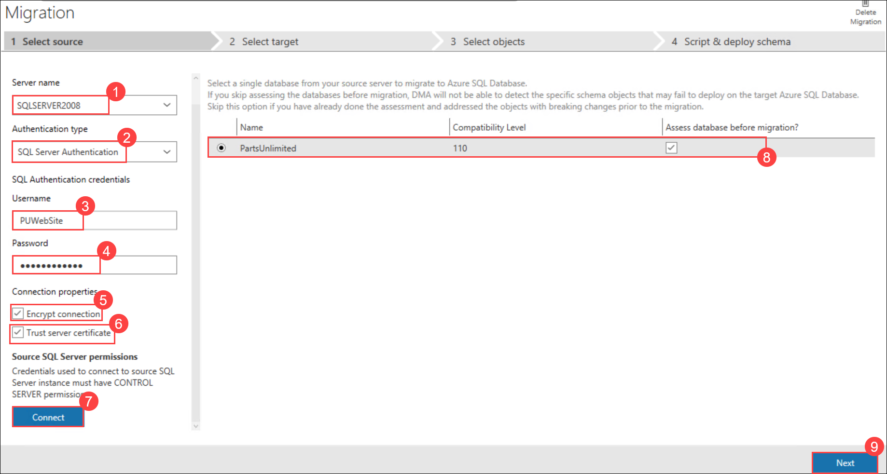

1. On the **Select target** tab, enter the following:

   - **Server name**: Enter the server name of your Azure SQL Database - **<inject key="sqlDatabaseName" enableCopy="false"/>.database.windows.net (1)** 
   - **Authentication type**: Select **SQL Server Authentication (2)**.
   - **Username**: Enter **demouser (3)**
   - **Password**: Enter **<inject key="SQL Password" /> (4)**
   - **Encrypt connection**: Check this box **(5)**.
   - **Trust server certificate**: Check this box **(6)**.
   - Select **Connect (7)**, and then ensure the `parts` database is selected **(8)** from the list of databases.
   - Select **Next (9)**.

   

1. On the **Select objects** tab, leave all the objects checked **(1)**, and select **Generate SQL script (2)**.

    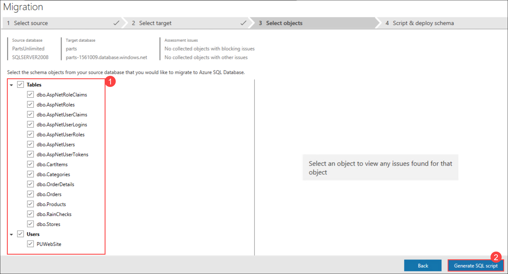

1. On the **Script & deploy schema** tab, review the script. Notice the view also provides a note that there are no blocking issues **(1)**. Now, select **Deploy schema (2)**.

    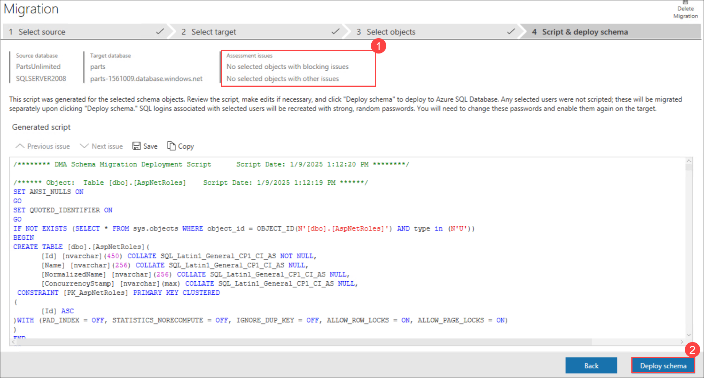

1. After the schema is deployed, review the deployment results, and ensure there are no errors.

    

1. Click on Windows **Start** menu to launch **SQL Server Management Studio (SSMS)**.

    

1. Start typing **sql server management** **(1)** into the search bar, and then selecting **SQL Server Management Studio 18 (2)** in the search results.

    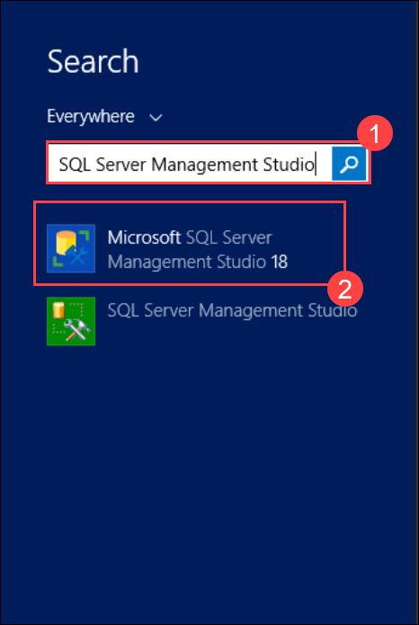

1. Close the **Connect to Server** pop up.

    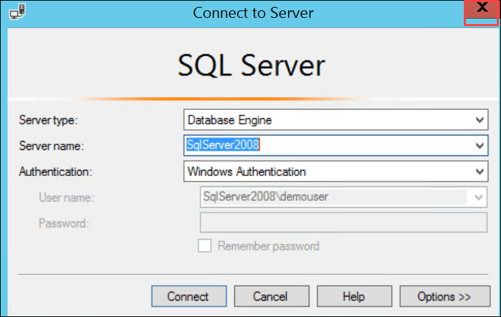

1. Connect to your Azure SQL Database, by selecting **Connect (1)->Database Engine (2)** in the **Object Explorer**.

    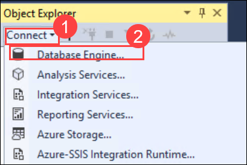

1. Enter the following into the Connect to server dialog:

    - **Server name**: Enter the server name of your Azure SQL Database - **<inject key="sqlDatabaseName" enableCopy="false"/>.database.windows.net (1)** 
    - **Authentication type**: Select **SQL Server Authentication (2)**.
    - **Login**: Enter **demouser (3)**
    - **Password**: Enter **<inject key="SQLVM Password" /> (4)**
    - **Remember password**: Check this box **(5)**.
    - Select **Connect (6)**.

    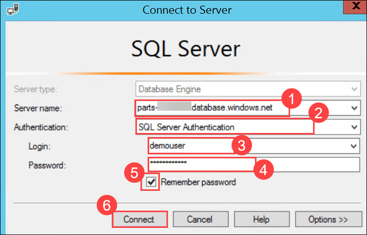

1. Once connected, expand **Databases (1)**, and expand **parts (2)**, then expand **Tables (3)**, and observe the schema that has been created **(4)**. 

    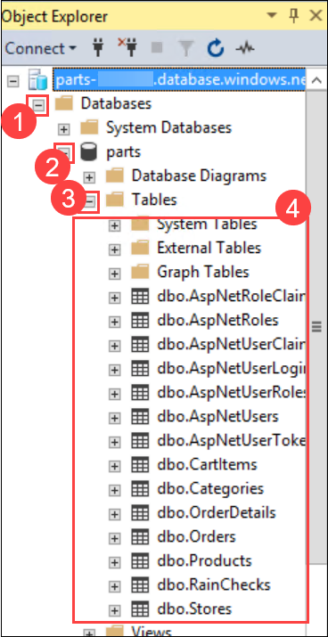

1. Expand **Security (1)> Users (2)** to observe that the database user is migrated as well **(3)**.

    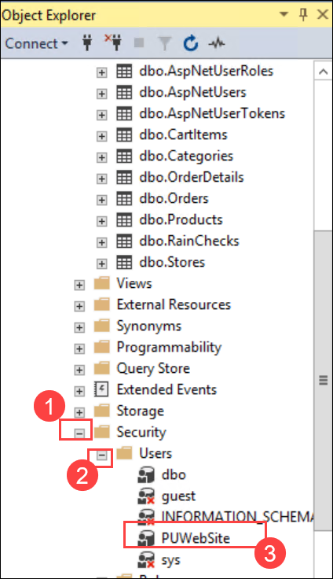.

> **Note**: You can now disconnect from the **SQLVM** and perform the remaining exercises from the **LabVM**.

### Task 5: Migrate the database using the Azure Database Migration Service 

At this point, you have migrated the database schema using DMA. In this task, you migrate the data from the `PartsUnlimited` database into the new Azure SQL Database using the Azure Database Migration Service.

> The [Azure Database Migration Service](https://docs.microsoft.com/azure/dms/dms-overview) integrates some of the functionality of Microsoft's existing tools and services to provide customers with a comprehensive, highly available database migration solution. The service uses the Data Migration Assistant to generate assessment reports that provide recommendations to guide you through the changes required prior to performing a migration. When you're ready to begin the migration process, Azure Database Migration Service performs all of the required steps.

1. In the [Azure portal](https://portal.azure.com), navigate to your Azure Database Migration Service by select the **hands-on-lab-<inject key="DeploymentID" enableCopy="false"/>** resource group, and then selecting the **parts-dms-<inject key="DeploymentID" enableCopy="false"/>** Azure Database Migration Service from the list of resources.

   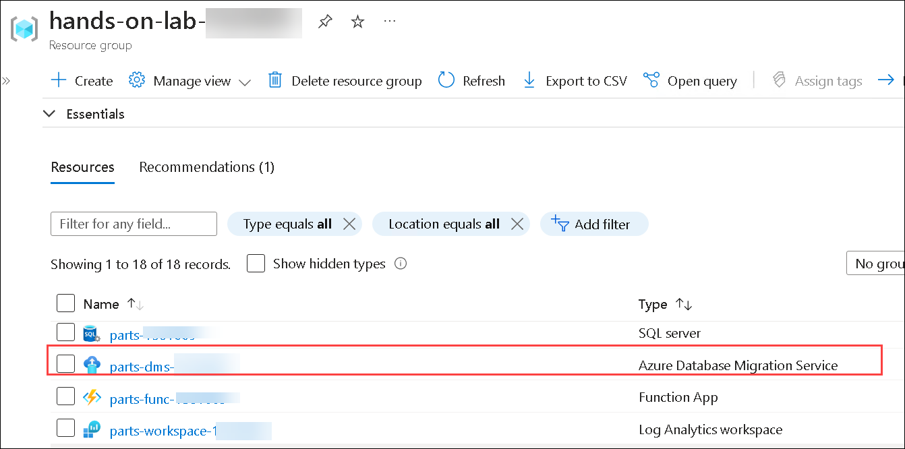

1. On the Azure Database Migration Service Blade, select **+ New Migration**.

    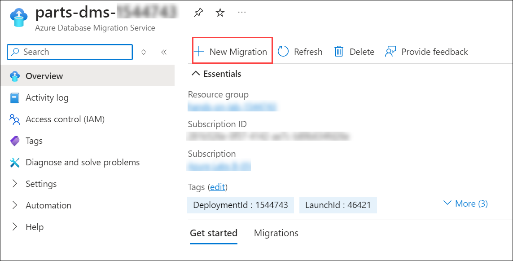

1. On the New migration project Blade, enter the following:

   - **Target server type**: Select **Azure SQL Database** **(1)**.
   - **Migration mode**: Select **Offline** **(2)**.
   - **Configure runtime settings** **(3)**.
   - When the **Configure integration runtime** pop-up appears, copy any one of the **two keys (4)** into a notebook.

     

1. Navigate back to the SQLVM, click the **Start** button. 

    

1. In the search box, type **Microsoft Integration Runtime** **(1)** then select **Microsoft Integration Runtime** **(2)** from the search results.

    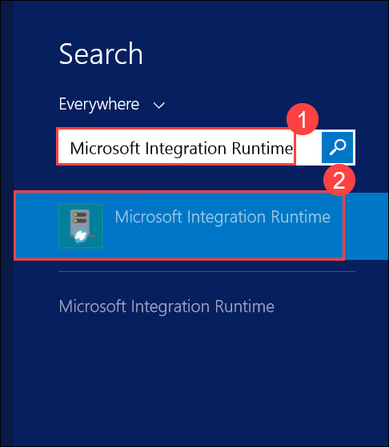

1. After successful installation it will ask you for the authentication key which we copied from the Azure portal, please provide the copied key **(1)** , and click on **Register (2)**.

   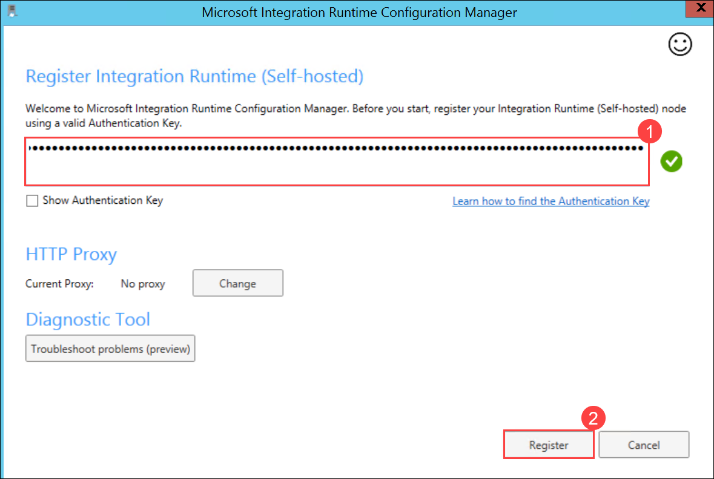

1. Click on **Finish**.

   .png "Migration Wizard Select source")

1. Once the Integration Runtime (Self-hosted) node has been **registered successfully**, minimize the SQLVM rdp window.
    
    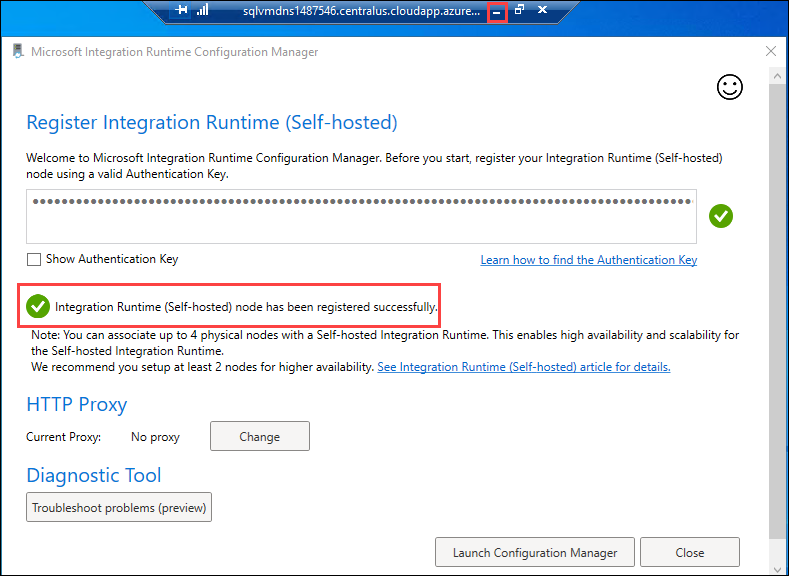

1. Navigate back to **Azure Database Migration Service** in the Azure portal, in **Configure integration runtime** pop-up click on **OK** **(1)**  and click on **Select** **(2)**.

   

1. On the Migration Wizard **Select source** Blade, enter the following:

   - **Source SQL Server instance name**: Enter the Private IP address of SqlServer2022. **(1)**.  
     >**Note** : To obtain the private IP address, search for and select **SqlServer2008** in the Azure portal. Navigate to the **Networking settings** under **Networking** section and copy the private IP address displayed there.

      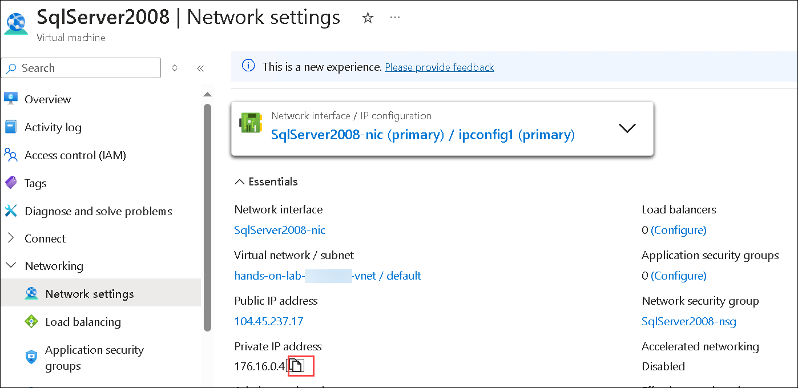     

   - **Authentication type**: Select **SQL Authentication (2)**.
   
   - **Username**: Enter **PUWebSite** **(3)**
   
   - **Password**: Enter **<inject key="SQLVM Password" />** **(4)**.
   
   - **Connection properties**: Check both the Encrypt connection and Trust server certificate **(5)**.
   
   - Select **Next: Select databases for migration** **(6)**. 
  
     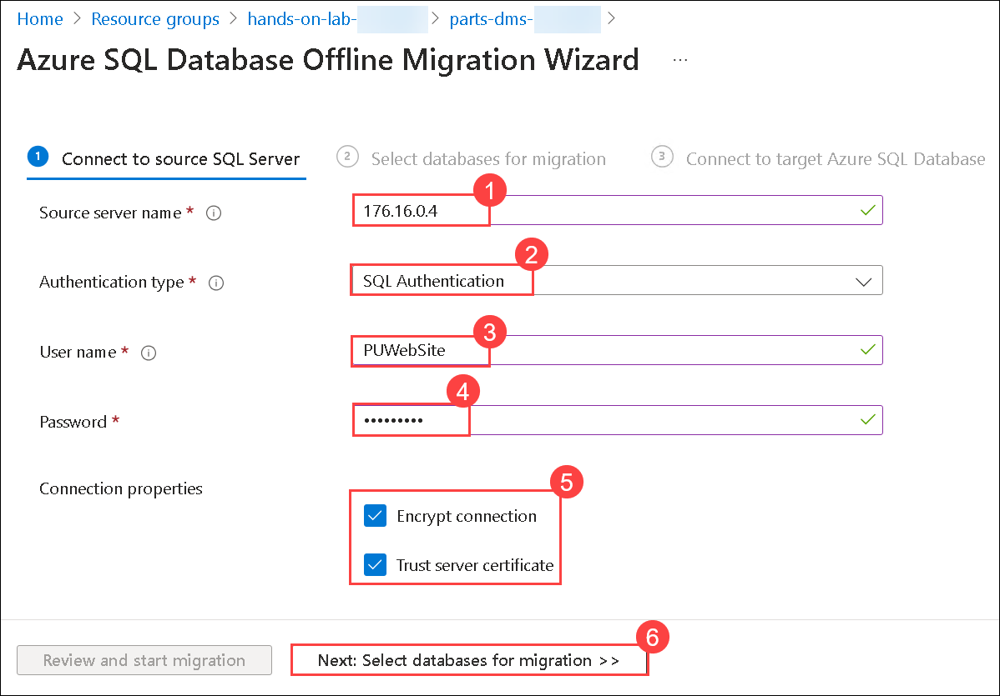
   
1. Select **PartsUnlimited (1)** databases. Select **Next: Connect to target Azure SQL Database >> (2)** to continue.
    
    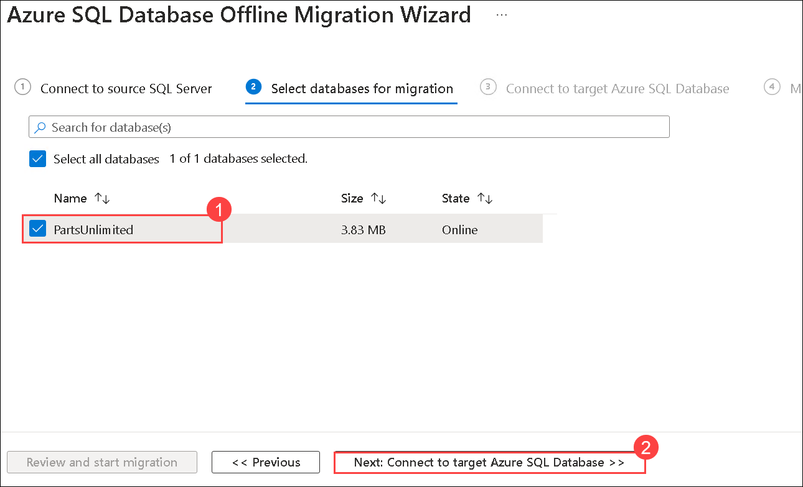

1. On the Migration Wizard **Select target** Blade, enter the following:

    - **Subscription**: Leave the default Subscription **(1)**
    
    - **Resource Group**: Select your **hands-on-lab-<inject key="DeploymentID" enableCopy="false"/>** resource group **(2)**

    - **Target Azure SQL Database Server**: Select **<inject key="sqlDatabaseName" 	enableCopy="false"/> (3)**
    
    - **Target server name**: Enter the server name of your Azure SQL Database - **<inject key="sqlDatabaseName" 	enableCopy="false"/>.database.windows.net (4)**
    
    - **Authentication type**: Select **SQL Authentication (5)**.
    
    - **Username**: Enter **demouser (6)**
    
    - **Password**: Enter **<inject key="SQLVM Password" /> (7)**
    
    - Select **Next: Map source and target databases >> (8)**.
    
        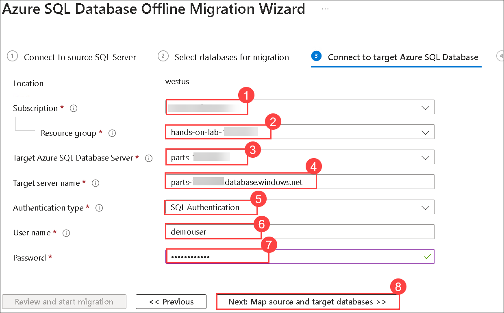

1. On the Migration Wizard **Map to target databases** Blade, confirm that **PartsUnlimited (1)** is checked as the source database, and **parts (2)** is the target database on the same line, then select **Next: Select database tables to migrate >> (3)**.

    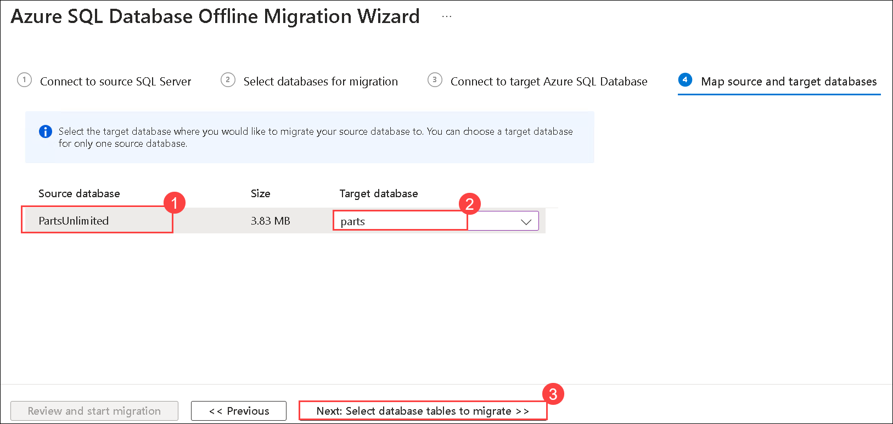

1. On the Migration Wizard **Configure migration settings** Blade, expand the **PartsUnlimited** database, verify all the tables are selected **(1)** and select **Next: Database migration Summary >> (2)**.

    > **Note**: If you see that table data cannot be migrated, the source table is empty. it is completely fine please select the tables that are not greyed out or the table has data in it.

    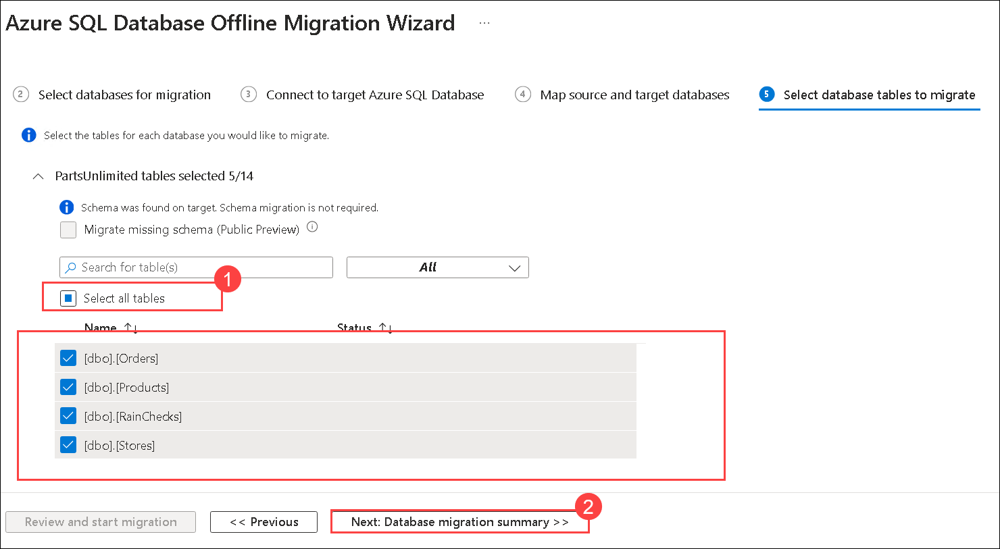

1. On the migration wizard **Summary** blade, select **Start migration** and monitor the migration status on the overview page of Database Migration Service at **Migration Status**.

    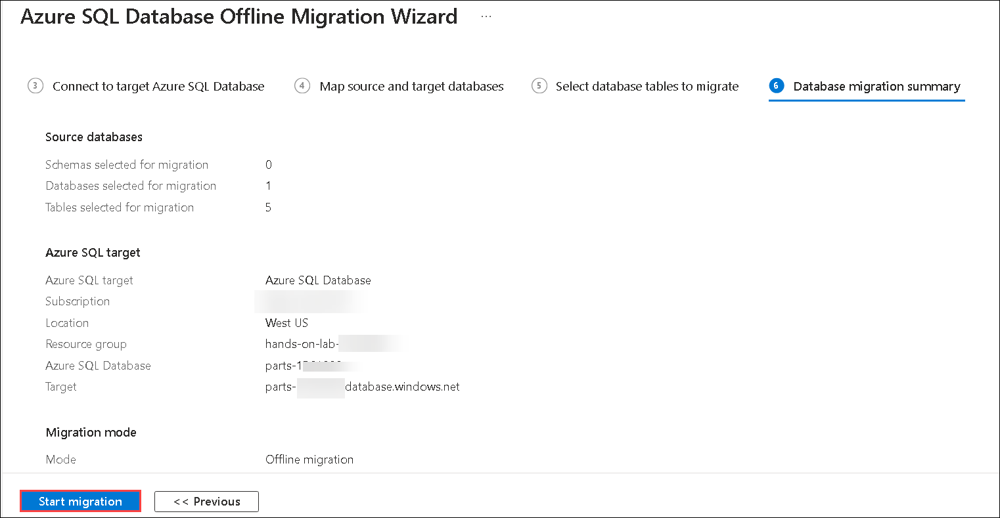

    

    > The migration takes approximately 2 - 3 minutes to complete.

1. When the migration is complete, you should see the status as **Succeeded**.

    
    
 ## Summary
 
In this exercise, you have migrated the on-premises database to Azure SQL Database.

### You have successfully completed the Exercise

**Click Next to proceed to the Next exercise**
